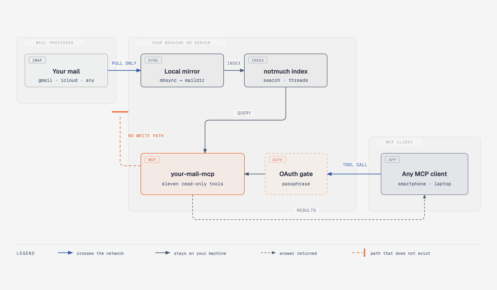

# your-mail-mcp

[](https://registry.modelcontextprotocol.io/v0.1/servers?search=io.github.wildsurfer)
[](https://glama.ai/mcp/servers/wildsurfer/your-mail-mcp)

Your mail already holds the answers: booking references, gate codes,
invoices, warranty periods, promises people made in writing. This server lets
your AI assistant find them, and it can only read.

**Ask it things like:**

- "Find the booking reference for the June ferry."
- "What was the wifi password the hotel sent last summer?"
- "What did the accountant answer about VAT, and when?"
- "Collect everything between me and the builder about the roof, in order,
  and summarize who promised what."
- "What arrived this morning, across all my accounts, that actually needs me?"

**Use it for:**

- **Search that understands questions.** Full-text search over your whole
  history, every account in one index, phrased the way you think.
- **Triage from your phone.** A morning summary of what came in overnight,
  with junk already filtered out, from wherever you are.
- **Mail as context for other work.** Pull the client's requirements out of
  the thread and into your coding or writing session.
- **Agents you can leave running.** The process has no path that sends,
  deletes or moves a message. A malicious email that reaches your assistant
  gets read, and that is all that can happen to it. Scheduled digests and
  always-on agents are a calm thing to run.

Setup is two files and `docker compose up -d`. See [Quick start](#quick-start).

## How it works

A self-hosted MCP server. It mirrors one or more IMAP accounts into a local
maildir with [mbsync](https://isync.sourceforge.io/), indexes them with
[notmuch](https://notmuchmail.org/), and answers tool calls from that index.
The Claude and ChatGPT apps attach over HTTPS with OAuth; Claude Code, Codex,
Cursor and Claude Desktop attach over stdio on the same machine. Any MCP
client works, so if you want full privacy you can attach one backed by a
local LLM and your mail never leaves your machine.



Mail only ever moves left to right in that picture. The mirror is pull-only
by configuration. The one connection the Go code makes toward a provider is
an IMAP `LIST` per account, to learn what that server calls its junk and
trash folders; it never selects a mailbox and never fetches a message.
[Security](#security) has the full list of what the process cannot do. The
diagram source is
[`docs/diagrams/how-it-works.html`](docs/diagrams/how-it-works.html).

## Quick start

On your machine, for your machine. Docker is the only requirement; the image
at `ghcr.io/wildsurfer/your-mail-mcp` is built by CI for amd64 and arm64.

```bash
mkdir your-mail && cd your-mail
curl -fsSLO https://raw.githubusercontent.com/wildsurfer/your-mail-mcp/main/compose.yaml
curl -fsSL https://raw.githubusercontent.com/wildsurfer/your-mail-mcp/main/accounts.example.json -o accounts.json
```

Put your accounts in `accounts.json`. `${WORK_PASS}` is replaced from the
environment, so the file itself holds no password:

```json
{
  "accounts": [
    { "name": "work", "host": "imap.gmail.com", "user": "you@example.com", "password": "${WORK_PASS}" },
    { "name": "personal", "host": "imap.mail.me.com", "user": "you", "password": "${PERSONAL_PASS}" }
  ]
}
```

Put the passwords in `.env` next to `compose.yaml`:

```bash
# .env
WORK_PASS=your-gmail-app-password
PERSONAL_PASS=your-icloud-app-specific-password
```

`compose.yaml` passes `WORK_PASS` and `PERSONAL_PASS` into the container. An
account with another variable name needs that name added under
`environment:` there as well.

Two provider details cost people the most time. Gmail accepts only an app
password over IMAP, and app passwords need 2-step verification turned on
first. iCloud wants the short name before `@icloud.com` as `user`; the full
address fails to log in. Every key of the file is in
[the reference](docs/reference.md#the-accounts-file).

These two files hold your mail passwords. Keep the directory out of version
control and out of backups that leave the machine.

```bash
docker compose up -d
docker compose logs -f     # watch the first sync
```

Today's INBOX mail is searchable within minutes. The full history follows at
whatever pace the provider allows, and the `status` tool reports how far it
has got. A large Gmail account takes days, because Google caps IMAP downloads
at about 2.5GB per day; set `SYNC_TIMEOUT=8h` in `.env` for that first
mirror. [Provider notes](docs/reference.md#provider-notes) has the details.

Then connect a client. Claude Code:

```bash
claude mcp add your-mail -- docker exec -i your-mail-mcp your-mail-mcp stdio
```

Cursor and VS Code add it in one click, once the stack is up:

[](https://cursor.com/install-mcp?name=your-mail&config=eyJjb21tYW5kIjoiZG9ja2VyIiwiYXJncyI6WyJleGVjIiwiLWkiLCJ5b3VyLW1haWwtbWNwIiwieW91ci1tYWlsLW1jcCIsInN0ZGlvIl19)
[](https://insiders.vscode.dev/redirect/mcp/install?name=your-mail&config=%7B%22command%22%3A%22docker%22%2C%22args%22%3A%5B%22exec%22%2C%22-i%22%2C%22your-mail-mcp%22%2C%22your-mail-mcp%22%2C%22stdio%22%5D%7D)

<details>
<summary>Claude Desktop, Cursor, Codex and other stdio clients</summary>

Any client that starts an MCP server as a command:

```json
{ "command": "docker", "args": ["exec", "-i", "your-mail-mcp", "your-mail-mcp", "stdio"] }
```

Each session is a bridge into the running container, so every client sees
the same index and the same sync. Close the client and the session goes with
it.

Claude Code can also take it as a plugin, which adds the server and an
`email` skill that knows the query syntax:

```
/plugin marketplace add wildsurfer/your-mail-mcp
/plugin install your-mail@your-mail-mcp
```

Without a running stack,
`docker run -i --rm --env-file .env -v index:/index -v mail:/mail -v ./accounts.json:/config/accounts.json:ro ghcr.io/wildsurfer/your-mail-mcp`
starts a daemon for the life of one session. Fine for a look; use compose for
anything you want kept fresh.

</details>

## Use it from your phone

The Claude and ChatGPT smartphone apps reach a connector through the vendor's
servers, so the server needs a public HTTPS address. A tunnel gives it one:
the tunnel dials out, nothing listens on your home network, and the mail
stays on your machine.

With [Tailscale](https://tailscale.com/) installed, one command, the same on
macOS and Linux:

```bash
tailscale funnel --bg 8080
```

It prints a hostname like `https://your-machine.your-tailnet.ts.net`, and
`--bg` keeps it running across reboots. Put that hostname in `.env` together
with a passphrase, then restart:

```bash
# .env
PUBLIC_URL=https://your-machine.your-tailnet.ts.net
OAUTH_PASSPHRASE=pick-a-long-one-you-can-type-on-a-smartphone
```

```bash
docker compose up -d
```

`OAUTH_PASSPHRASE` is the only credential between the internet and your
mail. A wrong guess costs one second and guesses are serialised, and neither
of those saves a short passphrase. Use a long one you can still type on a
phone.

Funnel needs HTTPS certificates and the Funnel node attribute enabled for
your tailnet; the CLI offers to add the policy line the first time.
`tailscale funnel status` shows what is exposed, and
`tailscale funnel --https=443 off` takes it down.

Now add the connector. Neither the Claude nor the ChatGPT smartphone app can
add one, so you do it once on the web, and it then appears on the phone.

1. On [claude.ai](https://claude.ai) or in Claude Desktop, open
   **Settings → Connectors** and add a custom connector.
2. Give it a name and the URL `<PUBLIC_URL>/mcp`. Leave the advanced OAuth
   fields empty; the server registers clients itself.
3. Claude opens the consent page. Enter your `OAUTH_PASSPHRASE`.
4. Open the Claude app on your phone. The connector is already there; turn it
   on for a conversation from the tools menu in the composer.

`PUBLIC_URL` has to match what you type into the client exactly. The server
publishes `PUBLIC_URL + /mcp` as the `resource` in its OAuth metadata, and a
mismatch there is the most common reason a connector refuses to add.

<details>
<summary>Cloudflare Tunnel instead of Tailscale, on your own domain</summary>

Use this for a hostname on a domain you own. `mail.example.com` below has to
be **your** domain, already added to your Cloudflare account; Cloudflare does
not hand out hostnames for named tunnels.

```bash
cloudflared tunnel login
cloudflared tunnel create your-mail
```

`create` prints the tunnel's UUID and the path of the credentials file it
wrote; `cloudflared tunnel list` prints the UUID again if you lose it. Route
the hostname, then write `~/.cloudflared/config.yml`:

```bash
cloudflared tunnel route dns your-mail mail.example.com
```

```yaml
tunnel: your-mail
credentials-file: /Users/you/.cloudflared/f9e2….json   # the path create printed
url: http://localhost:8080
```

```bash
cloudflared tunnel run your-mail
```

To keep it running: on Linux, `sudo cloudflared service install`. On macOS,
install it through Homebrew and use `brew services start cloudflared`,
because the `sudo` install path looks for its certificate under the root
user's home and will not find the one `cloudflared tunnel login` wrote to
yours.

Then set `PUBLIC_URL=https://mail.example.com` in `.env` and
`docker compose up -d`.

</details>

<details>
<summary>ChatGPT, and Claude Code or Codex from another machine</summary>

**ChatGPT.** Custom MCP connectors live behind developer mode, which needs a
Pro, Plus, Business, Enterprise or Education account and is only available
on the web.

1. In ChatGPT on the web, open **Settings → Security and login** and turn on
   **Developer mode**. On Business and Enterprise workspaces an admin may have
   to allow it first.
2. Add a connector for a remote MCP server with the URL `<PUBLIC_URL>/mcp`
   and OAuth as the authentication. ChatGPT supports dynamic client
   registration, so there is nothing to paste.
3. Approve the consent page with your `OAUTH_PASSPHRASE`.
4. Open ChatGPT on your phone and enable the connector in a chat.

These menus move. If the names above do not match what you see, look for
developer mode in settings, then for the place that adds a connector by URL.
ChatGPT disables some MCP write actions on mobile, which changes nothing
here because this server has none.

**Claude Code:**

```bash
claude mcp add --transport http your-mail https://your-host/mcp
```

**Codex:**

```bash
codex mcp add your-mail --url https://your-host/mcp
codex mcp login your-mail
```

</details>

## Run it on a server

Pick this when the mirror should stay up whether or not your machine is on.
It costs a few dollars a month and one real trade-off: a full plaintext copy
of your mail moves onto a rented disk, with the app passwords next to it. The
install is the quick start plus a tunnel, on someone else's computer, and the
box needs hardening before it holds your mail. Both are in
[docs/server.md](docs/server.md).

## The tools

Eleven tools, all read-only:

| Tool | What it does |
|---|---|
| `search` | Search mail. Returns thread summaries as JSON. |
| `ids` | Return the message ids matching a query. |
| `files` | Return the maildir file paths matching a query. |
| `count` | Count the messages matching a query. |
| `show` | Show one message: headers and decoded body, as JSON. |
| `thread` | Show the whole thread containing a message. Excludes junk/trash replies by default; set `include_excluded` to include them. |
| `text` | Return the plain-text body of one message, converting HTML. |
| `folders` | List accounts, their folders, index tags, and each account's last sync and last error. |
| `refresh` | Sync every folder of one account or all accounts now, then reindex. Waits up to 20 seconds; if the pass is still running it says so. |
| `status` | Sync health per account: first-sync completion, last sync, messages indexed, errors and backoff. |
| `attachment` | One attachment or MIME part of a message, by part number from `show`. Images inline, text (JSON and XML included) as a marked block, other binaries as a signed download link. |

`search`, `ids`, `files` and `count` take a notmuch query (`from:`, `to:`,
`subject:`, `tag:`, `folder:`, `date:2026-01-01..2026-06-30`, combined with
and/or/not), an optional `account` to scope to one account, and can include
junk and trash with `include_excluded`. Junk and trash are discovered per
account over RFC 6154 SPECIAL-USE, so the exclusion works whatever those
folders are named and in whatever language. While an account's mirror is
still filling, these four tools prepend a note naming the account and how
many messages are indexed so far.

Attachments are listed in `show` and `thread` and served by the `attachment`
tool one part at a time: images inline up to 5MB, textual parts as marked
text, and other binaries as a short-lived signed link to
`GET /attachment/{id}/{part}` (a bearer token works there too). Without an
HTTP listener, an oversized binary is saved under `/index/attachments/` and
the tool returns the path to `docker cp`. That directory is capped at 1GB;
the oldest files go first.

## Why not one of the others

There are around forty email MCP servers on GitHub. Nearly all of them talk
live IMAP and ship a send path, which is the opposite of both choices this
server rests on. Two are close enough to name.

[igor47/notmuchproxy](https://github.com/igor47/notmuchproxy) is the nearest
thing that already existed, and a large part of why this one has the shape
it does. It reads a notmuch archive you keep up to date yourself, has no
write path, and takes a bearer token or full OIDC. Its query validation,
which rejects an unknown prefix with an explanation, is reimplemented here as
`validateQuery`. Two things differ: it assumes you already run mbsync and
notmuch, where this server generates the mbsync configuration, syncs every
account in parallel and discovers junk and trash over IMAP; and it has no
`account` parameter. If you already run a notmuch setup you are happy with,
notmuchproxy is the smaller thing to deploy and you should use it instead of
this.

[hgn/mcp-server-notmuch](https://github.com/hgn/mcp-server-notmuch) is stdio
only, so one client on one machine, and its handling of untrusted content is
the best in the survey. The single `render()` chokepoint here, which marks
every byte of mail text in one place so that no individual tool can forget
to, comes from its `render.py`.

The full survey, including which claims were read in source and which were
taken from a README, is in
[`docs/research/email-mcp-landscape.md`](docs/research/email-mcp-landscape.md).

## Security

Read this before you point it at a mailbox you care about.

**It cannot write.** The generated mbsync configuration for every account
carries `Sync Pull`, `Create Near`, `Remove None` and `Expunge None` (or,
for an account with `expunge_local` set, `Expunge Near`, which deletes local
files only), and the program writes that file itself, so nothing in it can
be edited into a push.
The only IMAP operation in the Go code is `LIST`, issued per account at
startup and hourly to find the junk and trash folders; an account with
`exclude_folders` set by hand skips even that. The process has no path that
sends, deletes, moves or tags a message, and nothing in it holds write
access to any account.

**Deleted mail stays in the mirror.** Mail you delete on the server is kept
on disk and hidden from search through notmuch's `deleted` tag. Set
`expunge_local: true` on an account to physically remove those local copies
instead. The account is still never written to, but the mirror then stops
being a backup: whatever disappears remotely disappears locally on the next
pass.

**How proven this is.** One author, one operator, three real accounts: one
iCloud and two Gmail. No third-party security review, and nobody else has
deployed it. notmuchproxy has zero stars and a more convincing production
story than this does.

**Passwords are plain text inside the container.** Account passwords come
from the environment and are written at startup into a generated mbsync
configuration at file mode `0600`. That file is not encrypted. Anything that
can read the container's environment, or that file, can read them. Disk
encryption, who can exec into the container and access to the host are the
operator's responsibility; the server makes no claim of encrypting
credentials at rest.

**One passphrase, one consent.** `OAUTH_PASSPHRASE` is checked in constant
time and gates the whole server with a single shared secret. It is not a
per-user credential system, and everyone holding the passphrase sees the
whole mailbox. It does not encrypt anything at rest. Treat it and the mail
passwords with the same care.

**A mailbox is a secret store.** Password resets, sign-in codes and magic
links all arrive by mail, so read access alone is enough to take over
accounts if it lands in the wrong hands or the wrong AI session. The
read-only design and the untrusted-content markers remove the write path and
the instruction channel; they do not make mail contents harmless. Connect
clients you trust. Agent workflows that need their own inboxes need their
own addresses, which is a different tool.

**A known gap.** `search`'s thread summaries include a display name for every
message in a matching thread, which the sender controls. A message in a
folder excluded by default (junk, trash) can still put its own
attacker-chosen name in front of you this way, even though its body never
does. `thread` and `show` are not subject to this. It is not fixed in this
release.

For a server that faces the internet,
[docs/server.md](docs/server.md#hardening) lists the hardening steps in the
order of how much each buys you.

## Reference

- [The accounts file](docs/reference.md#the-accounts-file): every key, with
  defaults.
- [Environment variables](docs/reference.md#environment-variables): sync
  interval and timeout, listener address, `INIT_MIRROR`.
- [Provider notes](docs/reference.md#provider-notes): iCloud, Gmail, Dovecot.
- [Troubleshooting](docs/reference.md#troubleshooting): the startup
  refusals, and why junk is sometimes not excluded.
- [Without Docker](docs/reference.md#without-docker): release binaries and
  what they shell out to.
- [Running it on a server](docs/server.md): install script, hardening, your
  own domain with Caddy.
- [Upgrading from 0.3.x](docs/upgrading.md).
- [Design spec](docs/specs/2026-08-19-your-mail-mcp-design.md) and
  [the survey of email MCP servers](docs/research/email-mcp-landscape.md).
